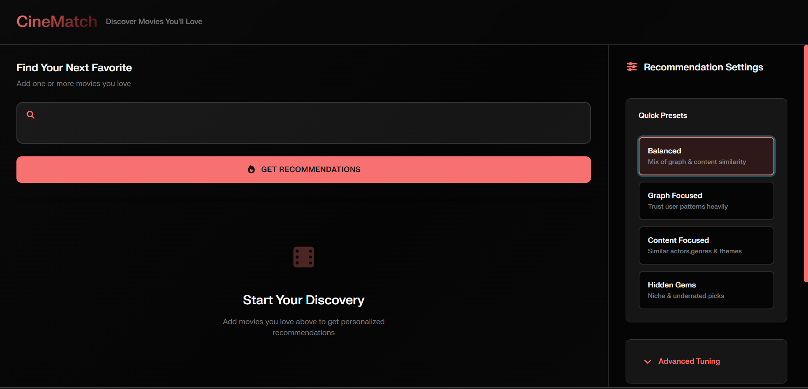
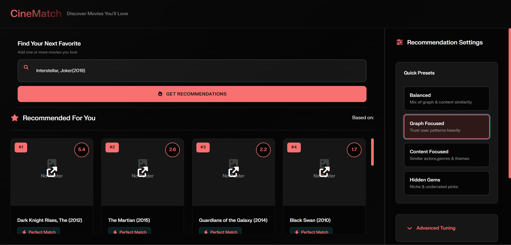

CineMatch: Hybrid GNN Movie Discovery Engine

CineMatch is a multi-stage recommendation system that moves beyond simple metadata matching. By combining FAISS-based vector retrieval with Graph Neural Networks (GNN), it identifies latent behavioral connections between films—surfacing "Hidden Gems" that traditional algorithms miss.

The Architecture: Two-Stage Retrieval
Most recommenders suffer from a "Filter Bubble." CineMatch breaks this using a high-performance pipeline:

Candidate Generation (FAISS): Performs a high-dimensional semantic search across 10,000+ movies to find an initial pool of candidates using plot and genre embeddings.

Latent Reranking (GNN): A Graph Neural Network (trained on MovieLens/IMDb) analyzes the "Aura" (user-item interaction clusters). It reranks candidates based on deep structural connectivity rather than just shared keywords.

Heuristic Filtering: A final layer applies strict penalties to "Title Junk" (sequels/reboots) and adjusts weights for cast affinity in real-time.

Tech Stack
Deep Learning: PyTorch, PyTorch Geometric (GNNs), Sentence-Transformers.

Vector Database: FAISS (Facebook AI Similarity Search).

Backend: FastAPI (Asynchronous, Type-safe).

Frontend: React (Vite), Tailwind/Custom CSS for the "Cyber-Neon" UI.

Data: Unified schema merging MovieLens, IMDb, and TMDB.

Quick Start
1. Backend Setup
PowerShell

# Create environment
python -m venv .venv
.\.venv\Scripts\Activate.ps1

# Install dependencies
pip install -r requirements.txt

# Run the ETL to prepare the Graph
python scripts/etl_schema.py

# Start the API
uvicorn app.main:app --reload
2. Frontend Setup
PowerShell

cd frontend/my-react-app
npm install
npm run dev
Ensure you create a .env file with your VITE_TMDB_API_KEY to see movie posters.

